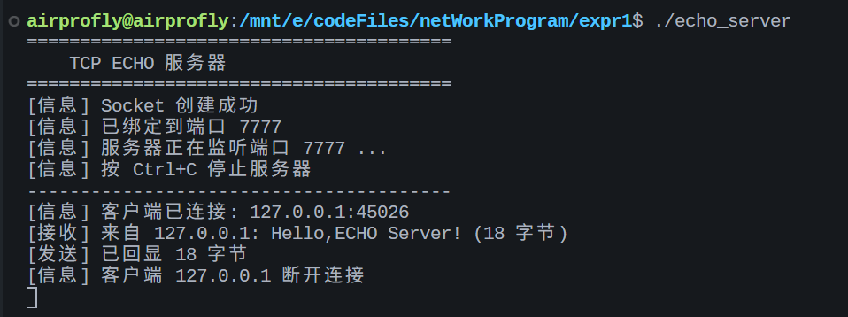
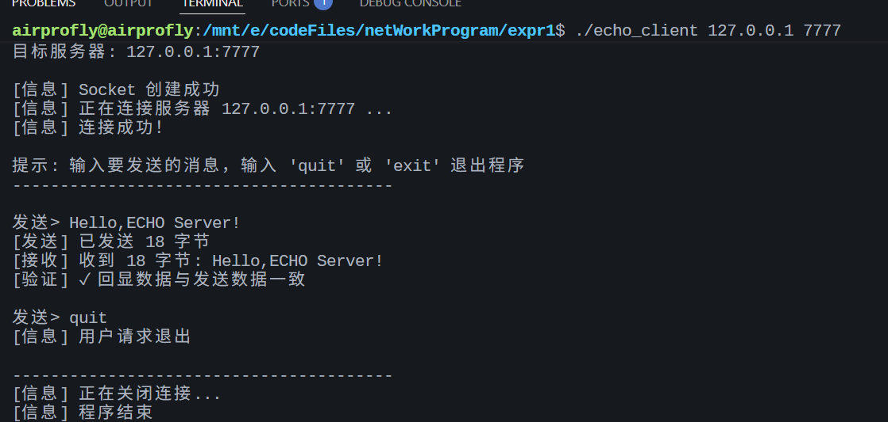

# TCP ECHO 客户端/服务器实验

## 实验名称

针对 ECHO 服务的 TCP 客户软件的实现

## 实验目的

1. 掌握客户端软件的工作原理
2. 掌握针对 ECHO 服务的 TCP 客户端软件的编程实现方法

## 文件说明

| 文件 | 说明 |
|------|------|
| `echo_client.c` | TCP ECHO 客户端源代码 |
| `echo_server.c` | TCP ECHO 服务器源代码（用于测试） |
| `Makefile` | 编译脚本 |

## 编译方法

### 使用 Makefile（推荐）

```bash
# 编译所有程序
make

# 仅编译客户端
make client

# 仅编译服务器
make server

# 清理编译产物
make clean
```

### 手动编译

```bash
# 编译客户端
gcc -Wall -o echo_client echo_client.c

# 编译服务器
gcc -Wall -o echo_server echo_server.c
```

## 运行方法

### 1. 启动服务器

在终端 1 中运行：

```bash
# 使用默认端口 7777
./echo_server

# 或指定端口
./echo_server 8888
```

输出示例：
```
========================================
    TCP ECHO 服务器
========================================
[信息] Socket 创建成功
[信息] 已绑定到端口 7777
[信息] 服务器正在监听端口 7777 ...
[信息] 按 Ctrl+C 停止服务器
----------------------------------------
```



### 2. 启动客户端

在终端 2 中运行：

```bash
# 连接到本地服务器
./echo_client 127.0.0.1 7777

# 或连接到远程服务器
./echo_client 192.168.1.100 7777
```
输出示例：
```
========================================
    TCP ECHO 客户端
========================================
目标服务器: 127.0.0.1:7777

[信息] Socket 创建成功
[信息] 正在连接服务器 127.0.0.1:7777 ...
[信息] 连接成功！

提示: 输入要发送的消息，输入 'quit' 或 'exit' 退出程序
----------------------------------------

发送> Hello, ECHO Server!
[发送] 已发送 19 字节
[接收] 收到 19 字节: Hello, ECHO Server!
[验证] ✓ 回显数据与发送数据一致

发送> quit
[信息] 用户请求退出

----------------------------------------
[信息] 正在关闭连接...
[信息] 程序结束
```
运行结果：


## 程序流程图

### 客户端流程

```
┌─────────────────┐
│   程序启动      │
└────────┬────────┘
         │
         ▼
┌─────────────────┐
│  解析命令行参数  │
└────────┬────────┘
         │
         ▼
┌─────────────────┐
│  创建 TCP Socket │
└────────┬────────┘
         │
         ▼
┌─────────────────┐
│  连接服务器      │
└────────┬────────┘
         │
         ▼
┌─────────────────┐
│  读取用户输入    │◄──────┐
└────────┬────────┘       │
         │                │
         ▼                │
┌─────────────────┐       │
│  发送数据        │       │
└────────┬────────┘       │
         │                │
         ▼                │
┌─────────────────┐       │
│  接收回显        │       │
└────────┬────────┘       │
         │                │
         ▼                │
┌─────────────────┐       │
│  显示并验证      │───────┘
└────────┬────────┘
         │ (退出)
         ▼
┌─────────────────┐
│  关闭连接        │
└─────────────────┘
```

## ECHO 协议说明

ECHO 协议（RFC 862）是一个简单的网络协议：

- **标准端口**: 7
- **工作方式**: 服务器将收到的任何数据原样返回给客户端
- **用途**: 网络连通性测试、调试

## 关键代码说明

### Socket 创建

```c
sock_fd = socket(AF_INET, SOCK_STREAM, 0);
```
- `AF_INET`: IPv4 协议族
- `SOCK_STREAM`: TCP 流式套接字
- `0`: 自动选择协议

### 地址转换

```c
inet_pton(AF_INET, argv[1], &server_addr.sin_addr);
```
- 将点分十进制 IP 字符串转换为网络字节序的二进制格式

### 字节序转换

```c
server_addr.sin_port = htons(port);
```
- `htons()`: Host to Network Short，主机字节序转网络字节序

### 连接服务器

```c
connect(sock_fd, (struct sockaddr *)&server_addr, sizeof(server_addr));
```

### 数据收发

```c
send(sock_fd, send_buffer, len, 0);    // 发送数据
recv(sock_fd, recv_buffer, BUFFER_SIZE - 1, 0);  // 接收数据
```

## 注意事项

1. **端口选择**: 标准 ECHO 端口 7 需要 root 权限，测试时建议使用 1024 以上的端口
2. **防火墙**: 确保防火墙允许相应端口的 TCP 连接
3. **资源释放**: 程序退出前务必调用 `close()` 关闭 Socket
4. **错误处理**: 所有系统调用都应检查返回值

## 实验报告要点

1. 客户端程序的工作流程
2. TCP 三次握手在 `connect()` 中的体现
3. 阻塞式 I/O 的特点
4. 回显验证的意义
