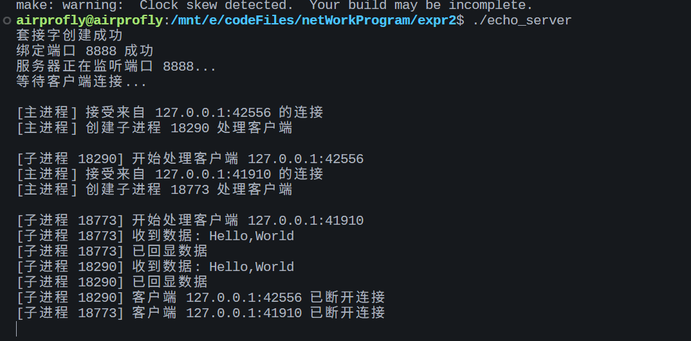
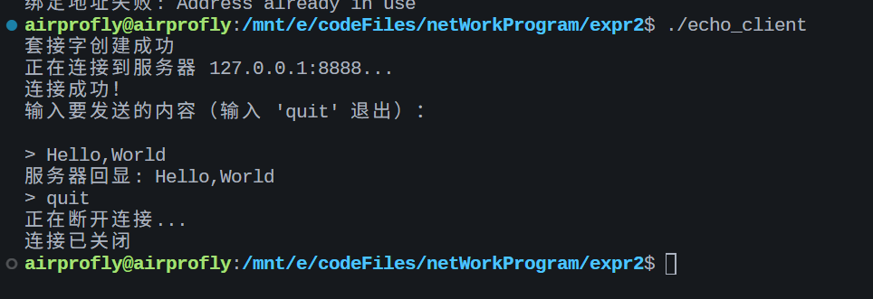

# 实验二：并发的面向连接的ECHO服务器

## 实验目的

1. 掌握服务端软件的工作原理
2. 掌握并发的面向连接的ECHO服务器软件的编程实现方法

## 程序说明

### 服务器程序 (echo_server.c)

并发ECHO服务器，使用TCP协议实现面向连接的服务。

**工作原理：**
1. 创建TCP套接字并绑定到指定端口
2. 监听客户端连接请求
3. 当有客户端连接时，使用`fork()`创建子进程处理该连接
4. 父进程继续监听新的连接请求
5. 子进程负责接收客户端数据并原样返回（ECHO功能）

**特点：**
- 使用多进程实现并发服务，可同时处理多个客户端
- 使用信号处理避免僵尸进程
- 支持地址重用，快速重启服务

### 客户端程序 (echo_client.c)

ECHO客户端，用于测试服务器功能。

**工作原理：**
1. 创建TCP套接字
2. 连接到服务器
3. 读取用户输入并发送到服务器
4. 接收并显示服务器回显的数据

## 编译方法

```bash
# 使用make编译
make

# 或者手动编译
gcc -Wall -o echo_server echo_server.c
gcc -Wall -o echo_client echo_client.c
```

## 运行方法

### 启动服务器

```bash
# 使用默认端口8888
./echo_server

# 或指定端口
./echo_server 9999
```

### 启动客户端

```bash
# 连接本地服务器（默认127.0.0.1:8888）
./echo_client

# 指定服务器地址和端口
./echo_client 192.168.1.100 9999
```

## 测试步骤

1. **启动服务器**
   ```bash
   ./echo_server
   ```
   输出示例：
   ```
   套接字创建成功
   绑定端口 8888 成功
   服务器正在监听端口 8888...
   等待客户端连接...
   ```

2. **启动多个客户端**（测试并发功能）
   
   在多个终端中分别运行：
   ```bash
   ./echo_client
   ```

3. **发送测试数据**
   
   在客户端输入任意文本，服务器将原样返回。
   
   客户端输出示例：
   ```
   套接字创建成功
   正在连接到服务器 127.0.0.1:8888...
   连接成功！
   输入要发送的内容（输入 'quit' 退出）：

   > Hello, World!
   服务器回显: Hello, World!
   > 测试并发ECHO服务
   服务器回显: 测试并发ECHO服务
   > quit
   正在断开连接...
   连接已关闭
   ```

4. **验证并发服务**
   
   同时在多个客户端发送数据，观察服务器是否能同时处理多个连接。

## 程序流程图

```
服务器端:                          客户端:
+----------------+                 +----------------+
| socket()       |                 | socket()       |
+-------+--------+                 +-------+--------+
        |                                  |
+-------v--------+                         |
| bind()         |                         |
+-------+--------+                         |
        |                                  |
+-------v--------+                         |
| listen()       |                         |
+-------+--------+                         |
        |                                  |
+-------v--------+                 +-------v--------+
| accept()       |<--------------->| connect()      |
+-------+--------+                 +-------+--------+
        |                                  |
+-------v--------+                         |
| fork()         |                         |
+---+-------+----+                         |
    |       |                              |
父进程     子进程                           |
    |       |                              |
    |  +----v----+                 +-------v--------+
    |  | recv()  |<--------------->| send()         |
    |  +----+----+                 +-------+--------+
    |       |                              |
    |  +----v----+                 +-------v--------+
    |  | send()  |<--------------->| recv()         |
    |  +----+----+                 +-------+--------+
    |       |                              |
    |  +----v----+                 +-------v--------+
    |  | close() |                 | close()        |
    |  +---------+                 +----------------+
    |
+---v---+
| 继续  |
| 监听  |
+-------+
```

## 清理

```bash
make clean
```
