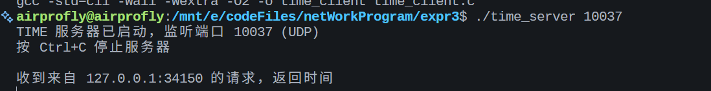
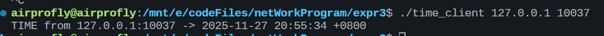

# UDP TIME 客户端与服务器 (RFC 868)

本项目实现了一个完整的 UDP TIME 服务，包括客户端和服务器，用于演示网络编程中的 UDP 通信。

## 文件说明

| 文件 | 说明 |
|------|------|
| `time_client.c` | UDP TIME 客户端源代码 |
| `time_server.c` | UDP TIME 服务器源代码 |
| `Makefile` | 编译脚本 |

## 编译

### Linux / macOS (使用 GCC)

```bash
make
```

将生成 `time_client` 和 `time_server` 两个可执行文件。

### Windows (PowerShell，需安装 gcc/MinGW)

```powershell
gcc -std=c11 -Wall -Wextra -O2 -o time_server.exe time_server.c
gcc -std=c11 -Wall -Wextra -O2 -o time_client.exe time_client.c
```

## 验证测试

### 步骤 1：启动服务器

打开一个终端，运行服务器（默认监听端口 37，需要 root/管理员权限）：

```bash
# Linux/macOS（端口 37 需要 root 权限）
sudo ./time_server

# 或者使用非特权端口（如 10037）进行测试
./time_server 10037
```

服务器启动后会显示：
```
TIME 服务器已启动，监听端口 37 (UDP)
按 Ctrl+C 停止服务器
```

### 步骤 2：运行客户端

打开另一个终端，运行客户端连接服务器：

```bash
# 连接本地服务器（默认端口 37）
./time_client 127.0.0.1

# 如果服务器使用非标准端口，需要修改客户端代码中的 TIMEPORT
./time_client 127.0.0.1 10037
```
`
### 预期输出

**服务器端：**
```
收到来自 127.0.0.1:xxxxx 的请求，返回时间
```



**客户端：**
```
TIME from 127.0.0.1: 2025-11-27 15:30:45 +0800
```


## 工作原理

```
┌────────────┐                      ┌────────────┐
│   客户端   │  ──── UDP请求 ────▶  │   服务器   │
│            │      (1 字节)        │            │
│            │                      │            │
│            │  ◀── 时间响应 ────  │            │
│            │   (4 字节大端序)     │            │
└────────────┘                      └────────────┘
```

1. **客户端**向服务器发送一个单字节（值为 0）的 UDP 数据报作为请求
2. **服务器**接收请求后，获取当前系统时间，转换为自 1900-01-01 00:00:00 以来的秒数
3. **服务器**将该时间值以 4 字节大端序格式返回给客户端
4. **客户端**接收响应，将 1900 纪元时间转换为 Unix 时间戳，并以本地时间格式输出

## 注意事项

- 标准 TIME 服务使用端口 37，在 Linux 上需要 root 权限才能绑定
- 测试时可以使用高位端口（如 10037），但需要同时修改客户端和服务器的端口配置
- 如果客户端长时间无响应，可能是服务器未启动或防火墙阻止了 UDP 通信