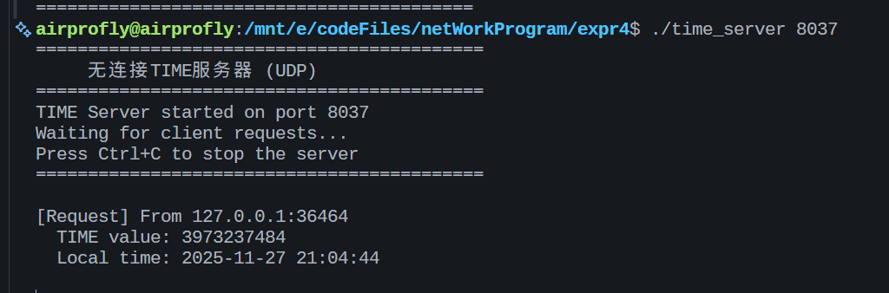
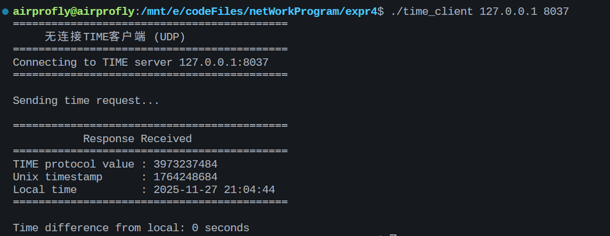

# 无连接的TIME服务器软件实验

## 实验目的

1. 掌握服务端软件的工作原理
2. 掌握无连接的TIME服务器软件的编程实现方法

## 实验内容

1. 使用C语言编写无连接的TIME服务器软件的源代码
2. 对代码进行编译和调试，生成执行程序
3. 在PC机上执行程序，检验程序能提供的TIME服务功能

## 项目结构

```
expr4/
├── README.md           # 项目说明文档
├── Makefile            # 编译脚本
├── time_server.c       # TIME服务器端程序
├── time_client.c       # TIME客户端程序
└── common.h            # 公共头文件
```

## TIME协议说明

TIME协议（RFC 868）是一个简单的时间协议：
- 使用UDP端口37
- 服务器返回一个32位无符号整数，表示从1900年1月1日00:00:00 UTC到当前时间的秒数
- 由于Unix时间戳从1970年1月1日开始，需要加上从1900到1970的秒数差（2208988800秒）

## 编译方法

```bash
# 编译所有程序
make all

# 只编译服务器
make server

# 只编译客户端
make client

# 清理编译文件
make clean
```

## 运行方法

### 1. 启动服务器

```bash
# 使用默认端口37（需要root权限）
sudo ./time_server

# 使用自定义端口（建议使用大于1024的端口）
./time_server 8037
```

### 2. 运行客户端

```bash
# 连接本地服务器（默认端口37）
./time_client 127.0.0.1

# 连接本地服务器（自定义端口）
./time_client 127.0.0.1 8037
```

## 程序说明

### 服务器端 (time_server.c)

1. 创建UDP套接字
2. 绑定到指定端口
3. 循环等待客户端请求
4. 收到请求后，获取当前时间并转换为TIME协议格式
5. 将时间发送给客户端

### 客户端 (time_client.c)

1. 创建UDP套接字
2. 向服务器发送时间请求
3. 接收服务器返回的时间值
4. 将TIME协议时间转换为可读格式并显示

## 测试示例

```
$ ./time_server 8037
TIME Server started on port 8037
Waiting for client requests...
Received request from 127.0.0.1:54321
Sent time: 3941234567 (Wed Nov 27 10:30:00 2025)

$ ./time_client 127.0.0.1 8037
Connecting to TIME server 127.0.0.1:8037
Received TIME value: 3941234567
Current time: Wed Nov 27 10:30:00 2025
```

## 测试结果


## 注意事项

1. 标准TIME服务使用端口37，需要root权限才能绑定
2. 测试时建议使用大于1024的端口号
3. 确保防火墙允许UDP通信
4. 本程序使用网络字节序（大端序）传输数据

## 参考资料

- RFC 868 - Time Protocol
- Unix Network Programming
