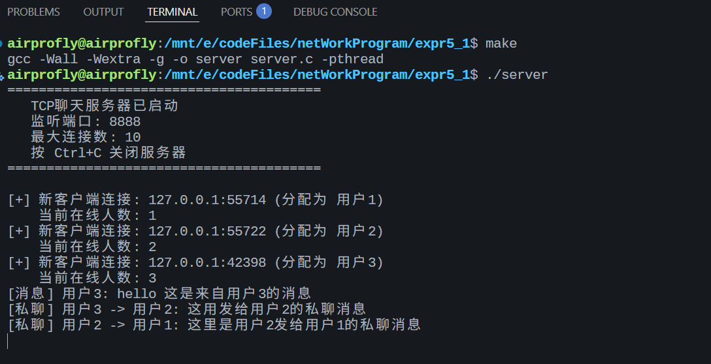
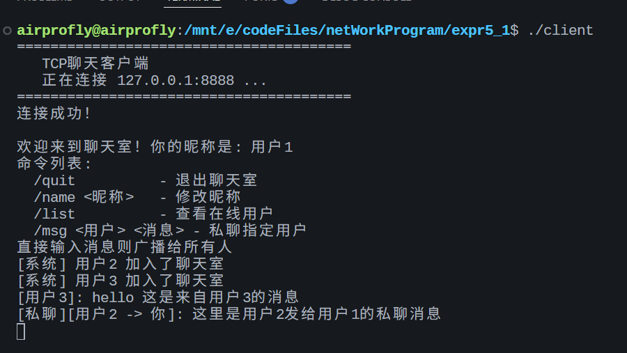
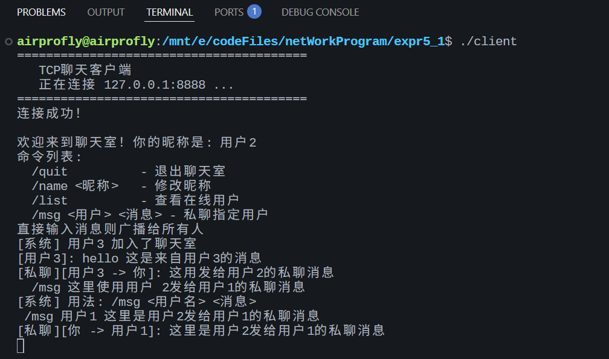
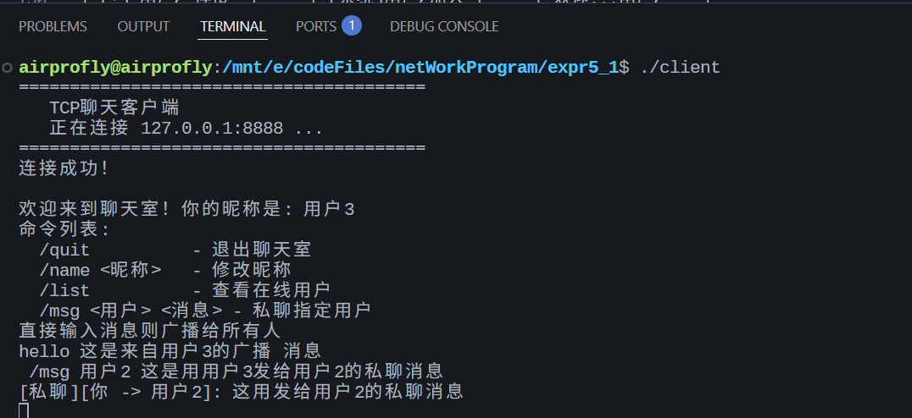

# 基于TCP协议的简单聊天软件

## 实验目的

1. 掌握服务端软件的工作原理
2. 掌握针对字符流的TCP客户/服务端软件的编程步骤和编程实现
3. 实现两个客户端之间的字符流消息传送

## 项目结构

```
expr5_1/
├── server.c    # TCP聊天服务器源代码
├── client.c    # TCP聊天客户端源代码
├── Makefile    # 编译脚本
└── README.md   # 项目说明文档
```

## 运行环境

- **操作系统**: Linux
- **编程语言**: C
- **编译器**: GCC

## 编译方法

### 使用 Makefile 编译

```bash
# 编译服务器和客户端
make

# 只编译服务器
make server

# 只编译客户端
make client

# 清理编译产物
make clean

# 查看帮助
make help
```

### 手动编译

```bash
# 编译服务器
gcc -Wall -o server server.c -pthread

# 编译客户端
gcc -Wall -o client client.c -pthread
```

## 运行方法

### 1. 启动服务器

```bash
./server
```

服务器启动后会在 **8888** 端口监听，等待客户端连接。

### 2. 启动客户端

打开新的终端窗口，运行客户端：

```bash
# 连接本地服务器
./client

# 连接指定IP的服务器
./client 192.168.1.100

# 连接指定IP和端口的服务器
./client 192.168.1.100 9999
```

### 3. 开始聊天

可以同时启动多个客户端，客户端之间的消息会通过服务器转发。

## 验证客户端之间消息传送

### 验证步骤

1. **打开3个终端窗口**

2. **终端1 - 启动服务器**
   ```bash
   ./server
   ```

3. **终端2 - 启动客户端1**
   ```bash
   ./client
   ```

4. **终端3 - 启动客户端2**
   ```bash
   ./client
   ```

### 验证广播消息

在**客户端1**输入：
```
你好，我是用户1
```

**预期结果**：客户端2 收到 `[用户1]: 你好，我是用户1`

在**客户端2**输入：
```
你好用户1，我是用户2
```

**预期结果**：客户端1 收到 `[用户2]: 你好用户1，我是用户2`

### 验证私聊消息

在**客户端1**输入：
```
/msg 用户2 这是私聊消息
```

**预期结果**：
| 终端 | 显示内容 |
|------|----------|
| 客户端1 | `[私聊][你 -> 用户2]: 这是私聊消息` |
| 客户端2 | `[私聊][用户1 -> 你]: 这是私聊消息` |
| 服务器 | `[私聊] 用户1 -> 用户2: 这是私聊消息` |






### 验证流程示意图

```
┌─────────────────┐     ┌─────────────────┐     ┌─────────────────┐
│    终端1        │     │    终端2        │     │    终端3        │
│   (服务器)      │     │   (客户端1)     │     │   (客户端2)     │
├─────────────────┤     ├─────────────────┤     ├─────────────────┤
│ ./server        │     │ ./client        │     │ ./client        │
│                 │     │                 │     │                 │
│ [+] 用户1 连接  │     │ 欢迎...用户1    │     │                 │
│ [+] 用户2 连接  │     │ [系统]用户2加入 │     │ 欢迎...用户2    │
│                 │     │                 │     │                 │
│ [消息] 用户1... │     │ > 大家好        │──┐  │                 │
│                 │     │                 │  │  │ [用户1]: 大家好 │
│                 │     │                 │  └─>│                 │
│                 │     │                 │     │                 │
│ [消息] 用户2... │     │ [用户2]: 收到   │<─┐  │ > 收到          │
│                 │     │                 │  └──│                 │
│                 │     │                 │     │                 │
│ [私聊]用户1->2  │     │ > /msg 用户2 Hi │──┐  │                 │
│                 │     │ [私聊][你->用户2]│  │  │ [私聊][用户1->你]│
│                 │     │                 │  └─>│   Hi            │
└─────────────────┘     └─────────────────┘     └─────────────────┘
```

## 客户端命令

| 命令 | 功能 |
|------|------|
| `/quit` | 退出聊天室 |
| `/name <新昵称>` | 修改昵称 |
| `/list` | 查看在线用户列表 |
| `/msg <用户名> <消息>` | 私聊指定用户 |
| `Ctrl+C` | 强制退出 |

## 功能特性

### 服务器端

- 支持多客户端同时连接（最多10个）
- 消息广播转发
- **私聊功能：支持指定用户发送消息**
- 客户端上下线通知
- 线程安全的客户端管理
- 优雅退出（Ctrl+C）

### 客户端

- 实时接收消息
- 修改昵称
- 查看在线用户
- **私聊指定用户**
- 支持命令行参数配置服务器地址和端口

## 程序设计说明

### TCP通信流程

```
服务器端:                          客户端:
  socket()                           socket()
     |                                  |
  bind()                                |
     |                                  |
  listen()                              |
     |                                  |
  accept() <----------------------- connect()
     |                                  |
  recv()/send() <----------------> send()/recv()
     |                                  |
  close()                            close()
```

### 关键技术点

1. **多线程处理**: 服务器使用 pthread 为每个客户端创建独立的处理线程
2. **互斥锁保护**: 使用 `pthread_mutex_t` 保护共享的客户端列表
3. **信号处理**: 处理 SIGINT 信号实现优雅退出
4. **消息广播**: 服务器接收到消息后转发给其他所有客户端

### 核心数据结构

```c
// 客户端信息结构体
typedef struct {
    int sockfd;              // socket文件描述符
    struct sockaddr_in addr; // 客户端地址
    char name[32];           // 客户端昵称
    int active;              // 是否活跃
} ClientInfo;
```

## 示例运行

### 服务器端输出

```
========================================
   TCP聊天服务器已启动
   监听端口: 8888
   最大连接数: 10
   按 Ctrl+C 关闭服务器
========================================

[+] 新客户端连接: 127.0.0.1:54321 (分配为 用户1)
    当前在线人数: 1
[+] 新客户端连接: 127.0.0.1:54322 (分配为 用户2)
    当前在线人数: 2
[消息] 用户1: 大家好！
[*] 用户2 改名为 张三
[消息] 张三: 你好，用户1！
```

### 客户端输出

```
========================================
   TCP聊天客户端
   正在连接 127.0.0.1:8888 ...
========================================
连接成功！

欢迎来到聊天室！你的昵称是: 用户1
输入消息后按回车发送，输入 /quit 退出
输入 /name <新昵称> 修改昵称
输入 /list 查看在线用户

[系统] 用户2 加入了聊天室
大家好！
[张三]: 你好，用户1！
```

## 注意事项

1. 确保服务器端口（默认8888）未被其他程序占用
2. 如果在不同机器上运行，确保防火墙允许该端口的通信
3. 服务器关闭时会通知所有在线客户端

## 扩展建议

- 实现用户认证
- 添加聊天记录保存
- 支持文件传输
- 添加加密通信
